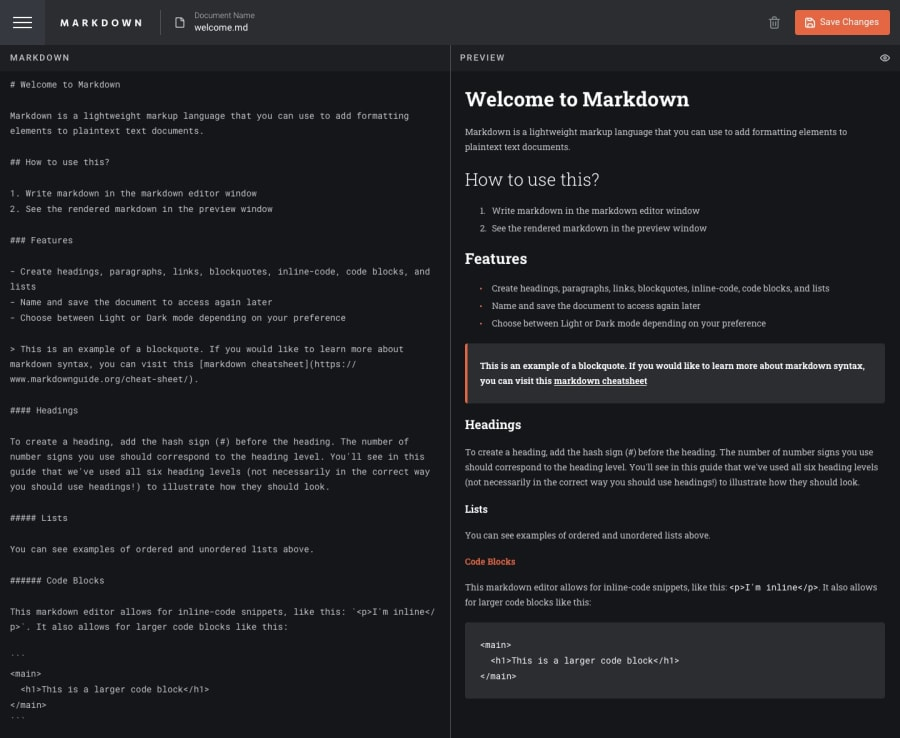

# React Markdown Editor




Markdown editor should be able to parse
- Heading 1 (#)
- Heading 2 (##)
- Heading 3 (###)
- List item (-)
- Horizontal Rule (`---`)
- Bold text (`**text**`)
- BlockQuote (`>`)
- Code Block (```)


# Style Guide

## Colors
- Orange: #e86842
- Background: #15161b
- Dark grey: #2c2d31

## Fonts
- [Commissioner](https://fonts.google.com/specimen/Commissioner)
- Roboto Slab
- Roboto Mono
